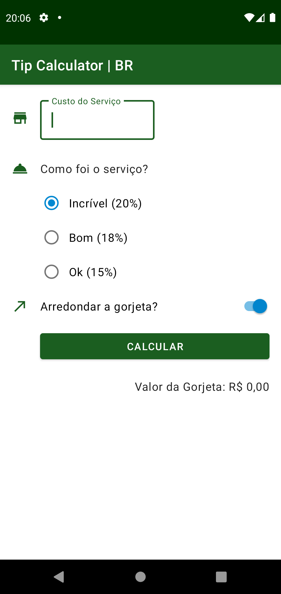
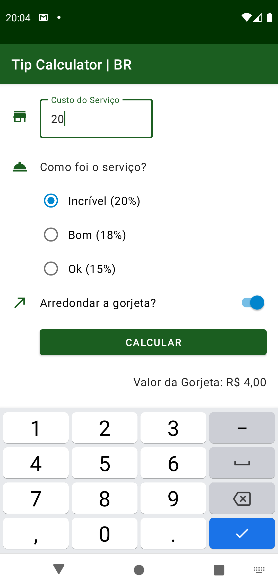

## TipCalculatorBR-app-android

### 📄 Descrição:

Aplicativo Android com Kotlin, que calcula gorjetas, com experiência de usuário mais sofisticada por meio dos Componentes do Material Design (MDC).    
O cálculo é efetuado de acordo com o valor do serviço e a porcentagem estabelecida para cada nível de avaliação, que é dada pelo cliente.  
E, existe a possibilidade do cliente arredondar ou não o valor da gorjeta.

##

### 📲 Layout:

- tela inicial - sem dados inseridos e sem cálculo efetuado:
<h1>
  
</h1>
 

- tela posterior - com os dados inseridos e o cálculo efetuado:
<h1>
  
</h1>

### 📍 Autora:

- NATHÁLIA MIRIAM
- LinkedIn: https://www.linkedin.com/in/nathaliamiriam/
- Portfólio: https://nathaliamiriam.github.io/
